# DuplicateCheck 🔍

A high-performance Go library for detecting duplicate or near-duplicate products in ecommerce catalogs using advanced string similarity algorithms. This tool helps you identify potential duplicates by comparing **product names AND descriptions** (up to 3000+ characters) using customizable weighting.

[](https://go.dev/)
[](LICENSE)

## 🎯 Purpose

In ecommerce, duplicate product listings can:

- Confuse customers and hurt user experience
- Reduce conversion rates
- Cause inventory management issues
- Impact SEO performance

This tool helps you automatically detect potential duplicates by comparing product names and descriptions with configurable weights.

## ✅ Features

- **Pluggable Architecture**: Easy to extend with new algorithms
- **Multiple Algorithms**: Levenshtein (optimized) and Hybrid (MinHash+LSH)
- **Blazing Fast**: Up to **411x faster** with advanced optimizations
- **Smart Pre-filtering**: Rabin-Karp rolling hash for O(n) pre-filtering (v1.2.0+)
- **N-gram Caching** (v1.3.0+): 1000x faster repeated comparisons with thread-safe cache
- **SimHash Filtering** (v1.3.0+): O(1) probabilistic similarity estimation for pre-filtering
- **SIMD Infrastructure** (v1.3.0+): Optional vectorization (30-50% speedup on long strings)
- **Description Support**: Compare names and descriptions (up to 3000+ chars)
- **Customizable Weights**: Adjust importance of name vs description
- **Memory Efficient**: 94% memory reduction with object pooling
- **Auto-Parallelization**: Multi-core processing for large datasets
- **Production Ready**: Comprehensive tests and benchmarks included

## 📦 Installation

```bash
go get github.com/solrac97gr/duplicatecheck
```

Or clone the repository:

```bash
git clone https://github.com/solrac97gr/DuplicateCheck.git
cd DuplicateCheck
go build -o duplicatecheck
```

## 🚀 Quick Start

### Basic Comparison

```go
package main

import (
    "fmt"
    "github.com/solrac97gr/duplicatecheck"
)

func main() {
    // Create engine
    engine := duplicatecheck.NewLevenshteinEngine()
    
    // Define products
    productA := duplicatecheck.Product{
        ID:          "SKU001",
        Name:        "Apple iPhone 14 Pro",
        Description: "Latest flagship with A16 chip",
    }
    
    productB := duplicatecheck.Product{
        ID:          "SKU002",
        Name:        "Apple iPhone 13 Pro",
        Description: "Previous gen with A15 chip",
    }
    
    // Compare
    result := engine.Compare(productA, productB)
    fmt.Printf("Similarity: %.2f%%\n", result.CombinedSimilarity*100)
}
```

### Finding Duplicates in Catalog

```go
// Levenshtein engine (optimized with caching, pooling, and parallelization)
engine := duplicatecheck.NewLevenshteinEngine()
duplicates := engine.FindDuplicates(products, 0.85) // 85% threshold
// Automatically uses parallel processing for >50 products

// For large catalogs (100+ products) - Use Hybrid for massive speedup
hybridEngine := duplicatecheck.NewHybridEngine()
hybridEngine.BuildIndex(catalogProducts) // One-time indexing
duplicates := hybridEngine.FindDuplicatesForOne(newProduct, 0.85)
```

### Custom Weights

```go
// Emphasize name more than description
weights := duplicatecheck.ComparisonWeights{
    NameWeight:        0.80, // 80% importance
    DescriptionWeight: 0.20, // 20% importance
}

result := engine.CompareWithWeights(productA, productB, weights)
```

## 🏗️ Architecture

### System Overview


### Hybrid Engine Pipeline

```mermaid
flowchart LR
    A[Input Product] --> B[Generate 3-gram Shingles]
    B --> C[Compute MinHash<br/>100 hash functions]
    C --> D[LSH Banding<br/>20 bands × 5 rows]
    D --> E[Candidate Selection<br/>0.2% of catalog]
    E --> F[Levenshtein<br/>Verification]
    F --> G[Final Results<br/>100% Accuracy]
    
    style A fill:#E3F2FD
    style D fill:#FFF3E0
    style F fill:#F3E5F5
    style G fill:#C8E6C9
```



## 🎯 Algorithm Selection Guide

### Current Algorithms

1. **Levenshtein Distance** (Edit Distance) - **HIGHLY OPTIMIZED**
   - Measures minimum number of single-character edits (insertions, deletions, substitutions)
   - Time Complexity: O(m × n)
   - Space Complexity: O(min(m, n)) - optimized with two-row approach
   - **Advanced optimizations**:
     - Cached normalized strings (avoid repeated lowercasing)
     - Early length termination (skip impossible matches)
     - Lazy description comparison (skip when not needed)
     - sync.Pool for slice reuse (reduce GC pressure)
     - Automatic parallelization (>50 products)
   - **Supports descriptions up to 3000+ characters efficiently**
   - Default weighting: 70% name, 30% description
   - Performance: **80,000+ comparisons/sec** (short strings)
   - Memory: **94% less** than naive implementation

2. **Hybrid (MinHash + LSH → Levenshtein)** ⚡ **RECOMMENDED FOR SCALE**
   - Multi-stage architecture for massive performance gains
   - Stage 1: MinHash (100 hash functions) + LSH (20 bands) for fast filtering
   - Stage 2: Levenshtein verification on candidate pairs only
   - **Now activates at 100+ products** (previously 500)
   - Time per query: **~15µs** (vs 28ms naive approach)
   - Candidate reduction: Checks only **0.2%** of total comparisons
   - Accuracy: **100% recall** (no false negatives)
   - Index build time: ~15ms for 100 products, ~75ms for 500 products
   - Best for: Medium-large catalogs (100+ products), 1-vs-many queries

### Performance Comparison

**Levenshtein Engine (Optimized vs Original)**

| Scenario | Original | Optimized | Speedup | Memory Saved |
|----------|----------|-----------|---------|--------------|
| 100 chars vs 100 products | 2.9ms | **180-298µs** | **10-16x** | 90% |
| 500 chars vs 100 products | 73.8ms | **450-895µs** | **82-164x** | 93% |
| 1000 chars vs 100 products | 290ms | **812-847µs** | **342-357x** | 93% |
| 1000 chars vs 1000 products | 2.96s | **7.2-7.6ms** | **389-411x** | 94% |

**Hybrid Engine Performance**

| Dataset Size | Build Index | Query Time | Speedup vs Naive | Candidates |
|--------------|-------------|------------|------------------|------------|
| 100 products | ~15ms | ~25µs | **160x** | 0.5% |
| 500 products | ~75ms | ~50µs | **574x** | 0.2% |
| 1000 products | ~160ms | ~25µs | **2,400x** | 0.1% |

### Use **Levenshtein Engine** when:
- ✅ Small to medium datasets (<100 products)
- ✅ Maximum accuracy is critical
- ✅ You need detailed edit distance information
- ✅ One-time batch comparisons
- ✅ Real-time comparisons of 2 products
- ✅ **Up to 400x faster than before with optimizations**

### Use **Hybrid Engine** when:
- ⚡ Medium to large datasets (100+ products)
- ⚡ Repeated 1-vs-many queries
- ⚡ Need to check one product against entire catalog
- ⚡ Performance is critical (API/real-time scenarios)
- ⚡ Can accept one-time indexing cost (~15-160ms)
- ⚡ **Now optimized for catalogs as small as 100 products**

**Recommendation**: 
- **<100 products**: Use optimized Levenshtein (now 400x faster!)
- **100-500 products**: Either engine works great (Hybrid gives 160-574x speedup)
- **500+ products**: Use Hybrid for maximum performance (up to 2400x speedup)

## ⚡ Performance Optimizations

DuplicateCheck includes several advanced optimizations for maximum performance:

### **Phase 1: Core Optimizations**
1. **Cached Normalized Strings** - Avoids repeated `ToLower()` and `TrimSpace()` calls
2. **Early Length Termination** - Skips computation when strings differ too much in length
3. **Lazy Description Comparison** - Only computes expensive description similarity when promising
4. **Lower Hybrid Threshold** - Hybrid engine activates at 100 products instead of 500

### **Phase 2: Advanced Optimizations**

5. **Slice Pooling (sync.Pool)** - Reuses DP matrix slices to reduce GC pressure
6. **Automatic Parallelization** - Multi-core processing for datasets >50 products
7. **Optimized Min Function** - Cleaner implementation for better CPU pipeline performance
8. **Pre-allocated Result Slices** - Reduces slice growth overhead

### **Phase 3: Pre-filtering with Rabin-Karp Rolling Hash** (v1.2.0+)

9. **Rabin-Karp Pre-filtering** - O(n) rolling hash pre-filtering for fast rejection of obviously dissimilar strings
   - Configurable window size (default: 5 characters)
   - Conservative approach: only applies to longer strings (>20 chars)
   - Safety margin: 0.25 threshold buffer to guarantee zero false negatives
   - Hybrid similarity estimation (character-based for short, rolling hash for long)
   - Expected speedup: 10-25% for diverse catalogs, 2-5% for brand-specific catalogs

10. **Smart Filter Control** - Enable/disable Rabin-Karp pre-filtering per engine instance
    - Useful for fine-tuning performance based on catalog characteristics
    - Can be toggled without rebuilding engine
    - Maintains backward compatibility

### **Results:**
- ⚡ **Up to 411x faster** on large datasets
- 💾 **94% memory reduction** (100MB → 6.5MB for 1000 products)
- 🚀 **80,000+ comparisons/sec** for short strings
- 🔄 **Auto-parallel processing** with zero configuration
- 🎯 **Rabin-Karp pre-filtering** reduces Levenshtein comparisons by 10-25%
- ✅ **100% accuracy** maintained across all optimizations (zero false negatives)

## 📖 Usage Examples

### Example 1: E-commerce Product Deduplication

```go
package main

import (
    "fmt"
    "github.com/solrac97gr/duplicatecheck"
)

func main() {
    // Load products from database
    products := loadProductsFromDB()
    
    // Create engine
    engine := duplicatecheck.NewLevenshteinEngine()
    
    // Find duplicates with 85% similarity threshold
    duplicates := engine.FindDuplicates(products, 0.85)
    
    // Process results
    for _, dup := range duplicates {
        fmt.Printf("Potential duplicate: %s <-> %s (%.2f%% similar)\n",
            dup.ProductA.Name,
            dup.ProductB.Name,
            dup.CombinedSimilarity*100)
    }
}
```

### Example 2: Real-time API with Hybrid Engine

```go
package main

import (
    "encoding/json"
    "net/http"
    "github.com/solrac97gr/duplicatecheck"
)

var catalogEngine *duplicatecheck.HybridEngine

func init() {
    // Initialize and index at startup
    catalogEngine = duplicatecheck.NewHybridEngine()
    products := loadAllProducts()
    catalogEngine.BuildIndex(products) // ~70-150ms one-time cost
}

func checkDuplicateHandler(w http.ResponseWriter, r *http.Request) {
    var newProduct duplicatecheck.Product
    json.NewDecoder(r.Body).Decode(&newProduct)
    
    // Ultra-fast query (~15µs)
    duplicates := catalogEngine.FindDuplicatesForOne(newProduct, 0.85)
    
    json.NewEncoder(w).Encode(map[string]interface{}{
        "found_duplicates": len(duplicates) > 0,
        "matches":          duplicates,
    })
}

func main() {
    http.HandleFunc("/check-duplicate", checkDuplicateHandler)
    http.ListenAndServe(":8080", nil)
}
```

### Example 3: Custom Weight Strategy

```go
// Prioritize name matching for clothing items
clothingWeights := duplicatecheck.ComparisonWeights{
    NameWeight:        0.90, // Brand and model very important
    DescriptionWeight: 0.10,
}

engine := duplicatecheck.NewLevenshteinEngineWithWeights(clothingWeights)

// Prioritize description for books
bookWeights := duplicatecheck.ComparisonWeights{
    NameWeight:        0.40, // Title can vary
    DescriptionWeight: 0.60, // Synopsis is key
}
```

### Example 4: Controlling Rabin-Karp Pre-filtering (v1.2.0+)

```go
// Create engine with Rabin-Karp pre-filtering enabled by default
engine := duplicatecheck.NewLevenshteinEngine()

// For diverse product catalogs - keep pre-filtering enabled
// (Rabin-Karp will reject 10-25% of dissimilar pairs before expensive Levenshtein)
duplicates := engine.FindDuplicates(products, 0.85)

// For similar product catalogs - disable pre-filtering
// (conservative filtering may pass most pairs through anyway)
engine.DisableRabinKarpFilter()
duplicates := engine.FindDuplicates(similarProducts, 0.85)

// Check if pre-filtering is active
if engine.IsRabinKarpEnabled() {
    fmt.Println("Rabin-Karp pre-filtering is active")
}

// Re-enable if needed
engine.EnableRabinKarpFilter()
```

## 🧪 Testing & Benchmarking

### Run All Tests

```bash
# Run all tests
go test ./...

# Run with coverage
go test -cover ./...

# Verbose output
go test -v ./...
```

### Run Benchmarks

```bash
# Quick performance matrix (recommended!)
go test -bench=BenchmarkQuickMatrix -timeout=10m

# Compare Hybrid vs Naive
go test -bench=BenchmarkHybridVsNaive -benchtime=5s

# All benchmarks
go test -bench=. -benchmem

# Run specific test suites
go test -v -run TestUserArticle           # User article duplication tests
go test -bench=BenchmarkUserArticle       # Article scanning benchmarks
go test -bench=BenchmarkHybridVsNaive     # Compare Hybrid vs Naive performance
```

### Test Suites

The comprehensive test suite includes:

1. **Basic Algorithm Tests** (\`levenshtein_test.go\`)
   - Edge cases (empty strings, Unicode, case sensitivity)
   - Name and description comparison
   - Custom weight configurations

2. **User Article Duplication Tests** (\`user_articles_test.go\`)
   - **Real-world scenario:** Check 1 new article against 500 existing articles
   - **Batch processing:** Check 10 articles against 500 existing articles
   - **Custom weighting:** Test different title vs. content weight strategies
   - **Performance:** ~540ms to scan 500 articles with descriptions

3. **Rabin-Karp Pre-filtering Tests** (\`rabin_karp_test.go\`) ⭐ **NEW in v1.2.0!**
   - **13 comprehensive test suites** with 80+ test cases
   - **Zero false negatives guaranteed** - tests verify no similar strings are rejected
   - Filter enable/disable functionality
   - Window size variations (1-32 characters)
   - Real product name scenarios (iPhone/Samsung variants)
   - Length sensitivity and bounds checking
   - Performance benchmarks for rolling hash operations
   - Similarity estimation bounds validation

4. **Performance Matrix Benchmark** (\`quick_bench_test.go\`)
   - **Comprehensive performance analysis** across text lengths and catalog sizes
   - Tests 100, 500, and 1000 character descriptions
   - Tests 10, 100, and 1000 product catalogs
   - **Beautiful formatted output** with P50/P95/P99 percentiles
   - **Automatic engine selection** (Levenshtein vs Hybrid)
   - **Performance ratings**: ✅ Excellent, ✅ Good, ⚠️ Slow, ❌ Very Slow, 💀 Critical

### Benchmark Output Format

```
=== SUMMARY ===

Test                      |  Num Ads |   P50 (med) |         P95 |         P99 |     Memory
--------------------------|----------|-------------|-------------|-------------|------------
100chars_vs_10ads         |       10 |    294.68µs |    405.30µs |    405.30µs |     0.74MB
100chars_vs_100ads        |      100 |  2.915867ms |  3.532519ms |  3.532519ms |     5.58MB
500chars_vs_1000ads       |     1000 | 747.254769ms | 848.807171ms | 848.807171ms |    84.62MB

=== ANALYSIS ===

100chars_vs_10ads        : P50=294.68µs, Throughput=3393/sec, Status=✅ Excellent
100chars_vs_100ads       : P50=2.915867ms, Throughput=342/sec, Status=✅ Good
500chars_vs_1000ads      : P50=747.254769ms, Throughput=1/sec, Status=❌ Very Slow
```

**💡 Key Insight**: Use Hybrid engine for catalogs >500 products to avoid performance degradation.

## 🔧 API Reference

### Core Types

```go
// Product represents an item in your catalog
type Product struct {
    ID          string
    Name        string
    Description string
}

// ComparisonResult contains similarity scores
type ComparisonResult struct {
    ProductA              Product
    ProductB              Product
    NameSimilarity        float64  // 0.0 to 1.0
    DescriptionSimilarity float64  // 0.0 to 1.0
    CombinedSimilarity    float64  // Weighted average
}

// ComparisonWeights defines importance of each field
type ComparisonWeights struct {
    NameWeight        float64  // Must sum to 1.0
    DescriptionWeight float64
}
```

### Levenshtein Engine

```go
// NewLevenshteinEngine creates engine with default weights (70% name, 30% description)
func NewLevenshteinEngine() *LevenshteinEngine

// NewLevenshteinEngineWithWeights creates engine with custom weights
func NewLevenshteinEngineWithWeights(weights ComparisonWeights) *LevenshteinEngine

// Rabin-Karp Pre-filtering Control (v1.2.0+)
func (e *LevenshteinEngine) EnableRabinKarpFilter()   // Enable pre-filtering (default)
func (e *LevenshteinEngine) DisableRabinKarpFilter()  // Disable pre-filtering
func (e *LevenshteinEngine) IsRabinKarpEnabled() bool // Check if enabled
```

**Use Cases:**

- Small to medium catalogs (<500 products)
- Maximum accuracy required
- One-time batch processing
- Simple 2-product comparison

**Rabin-Karp Pre-filtering:**

- Enabled by default in v1.2.0+
- Conservative approach: zero false negatives guaranteed
- Typical speedup: 10-25% for diverse catalogs
- Best for: Catalogs with varied product categories
- Disable for: Similar product name patterns (minimal filtering benefit)

### Hybrid Engine

```go
// NewHybridEngine creates a new Hybrid (MinHash+LSH) engine
func NewHybridEngine() *HybridEngine

// BuildIndex indexes products for fast querying (one-time cost)
func (e *HybridEngine) BuildIndex(products []Product)

// FindDuplicatesForOne finds duplicates for a single product (fast!)
func (e *HybridEngine) FindDuplicatesForOne(product Product, threshold float64) []ComparisonResult

// GetIndexStats returns statistics about the index
func (e *HybridEngine) GetIndexStats() map[string]interface{}
```

**Use Cases:**
- Large catalogs (500+ products)
- Repeated 1-vs-many queries
- Real-time API endpoints
- Performance-critical scenarios

**Important:** Call \`BuildIndex()\` once before querying. Index building takes ~70ms for 500 products.

## ⚙️ How It Works

### Hybrid Algorithm Deep Dive

```
┌─────────────────────────────────────────────────────────────┐
│ Stage 1: Fast Candidate Selection (LSH)                    │
│ ─────────────────────────────────────────────────────────── │
│ 1. Convert text to 3-grams (shingling)                     │
│    "Apple iPhone 14" → ["App", "ppl", "ple", ...]          │
│                                                              │
│ 2. Generate MinHash signature (100 hash functions)         │
│    Text → [h1, h2, h3, ... h100]                           │
│                                                              │
│ 3. LSH Banding (20 bands × 5 rows each)                   │
│    Similar products fall into same buckets                  │
│                                                              │
│ Candidate Reduction: 500 → 1-10 candidates (0.2-2%)       │
│ Time: ~300µs                                                │
└─────────────────────────────────────────────────────────────┘
                           ↓
┌─────────────────────────────────────────────────────────────┐
│ Stage 2: Precise Verification (Levenshtein)                │
│ ─────────────────────────────────────────────────────────── │
│ Input: Only LSH candidates (1-10 products instead of 500)  │
│                                                              │
│ Run full Levenshtein Distance on:                          │
│  • Product names (weighted 70%)                            │
│  • Descriptions up to 3000 chars (weighted 30%)            │
│                                                              │
│ Time: ~15µs (vs 28ms naive approach)                       │
│ Speedup: 500-2400x faster!                                  │
└─────────────────────────────────────────────────────────────┘
                           ↓
                   Final Results
              (100% Recall, No False Negatives)
```

### Levenshtein Distance - How It Works

Let's transform "APPLE" into "APPL":

```
       ""  A  P  P  L
   ""   0  1  2  3  4
   A    1  0  1  2  3
   P    2  1  0  1  2
   P    3  2  1  0  1
   L    4  3  2  1  0
   E    5  4  3  2  1  ← Distance = 1
```

Each cell shows the minimum edits needed to transform:
- \`cell[i,j]\` = min edits to transform first i chars of "APPLE" into first j chars of "APPL"
- Final answer (bottom-right): **1 edit** (delete 'E')

### Operations:
- **Insertion**: Add a character
- **Deletion**: Remove a character  
- **Substitution**: Replace one character with another

For each cell, we choose the minimum cost:
```
cell[i,j] = min(
    cell[i-1,j] + 1,      // deletion
    cell[i,j-1] + 1,      // insertion
    cell[i-1,j-1] + cost  // substitution (cost=0 if match, 1 if different)
)
```

## 🎯 Best Practices

### 1. Choose the Right Engine

```go
// Small catalog? Use Levenshtein
if len(products) < 500 {
    engine := duplicatecheck.NewLevenshteinEngine()
}

// Large catalog? Use Hybrid
if len(products) >= 500 {
    engine := duplicatecheck.NewHybridEngine()
    engine.BuildIndex(products)
}
```

### 2. Tune Threshold Based on Needs

```go
// Strict matching (reduce false positives)
strictDuplicates := engine.FindDuplicates(products, 0.95) // 95%+

// Moderate matching (balanced)
moderateDuplicates := engine.FindDuplicates(products, 0.85) // 85%+

// Loose matching (catch more variants)
looseDuplicates := engine.FindDuplicates(products, 0.75) // 75%+
```

### 3. Adjust Weights for Product Type

```go
// Brand-heavy products (phones, laptops)
techWeights := duplicatecheck.ComparisonWeights{
    NameWeight: 0.80, DescriptionWeight: 0.20,
}

// Description-heavy products (books, articles)
contentWeights := duplicatecheck.ComparisonWeights{
    NameWeight: 0.40, DescriptionWeight: 0.60,
}
```

### 4. Reuse Hybrid Index

```go
// DON'T rebuild index for every query
for _, product := range newProducts {
    engine := duplicatecheck.NewHybridEngine()
    engine.BuildIndex(catalog) // ❌ Wasteful!
    engine.FindDuplicatesForOne(product, 0.85)
}

// DO build index once, query many times
engine := duplicatecheck.NewHybridEngine()
engine.BuildIndex(catalog) // ✅ Once!

for _, product := range newProducts {
    engine.FindDuplicatesForOne(product, 0.85) // ✅ Fast!
}
```

### 5. Monitor Performance

```go
// Get index statistics
stats := hybridEngine.GetIndexStats()
fmt.Printf("Indexed: %v products\n", stats["total_products"])
fmt.Printf("Buckets: %v\n", stats["total_buckets"])
fmt.Printf("Avg bucket size: %.2f\n", stats["avg_bucket_size"])
```

## �� Performance Details

### Time Complexity

| Algorithm | Indexing | Single Query | Batch (n products) |
|-----------|----------|--------------|-------------------|
| Levenshtein | - | O(m×n) per pair | O(n² × m×n) |
| Hybrid | O(n × k) | O(b × c × m) | O(n × b × c × m) |

Where:
- n = number of products
- m = average text length
- k = number of hash functions (100)
- b = number of bands (20)
- c = average candidates per bucket (~1-10)

### Space Complexity

| Algorithm | Space |
|-----------|-------|
| Levenshtein | O(min(m,n)) per comparison |
| Hybrid | O(n × k) for index + O(1) per query |

### Accuracy Guarantees

| Algorithm | Recall | Precision | False Negatives | False Positives |
|-----------|--------|-----------|----------------|-----------------|
| Levenshtein | 100% | 100% | 0 | 0 |
| Hybrid | 100% | 100% | 0 | 0 |

Both algorithms provide **exact results** - Hybrid is just much faster!

## 🤝 Contributing

Contributions are welcome! Please feel free to submit a Pull Request.

### Adding a New Algorithm

1. Implement the \`DuplicateCheckEngine\` interface
2. Add comprehensive tests
3. Add benchmarks comparing with existing algorithms
4. Update this README

## 📄 License

MIT License - see LICENSE file for details

## �� References

- [Levenshtein Distance - Wikipedia](https://en.wikipedia.org/wiki/Levenshtein_distance)
- [String Similarity Metrics](https://en.wikipedia.org/wiki/String_metric)
- [MinHash - Stanford](http://infolab.stanford.edu/~ullman/mmds/ch3.pdf)
- [Locality Sensitive Hashing](https://www.pinecone.io/learn/locality-sensitive-hashing/)

---

**Made with Go** 🚀 | **Optimized for Production** ⚡ | **Open Source** ❤️

## 🔧 Advanced Configuration

### N-gram Caching (v1.3.0+)

N-grams are cached per-product for thread-safe repeated comparisons. The caching is lazy-initialized using a double-checked locking pattern:

```go
// Get cached n-grams (automatically generates and caches on first call)
ngrams := product.GetNgrams(3) // trigrams
```

**Thread Safety:**
- ✅ Multiple goroutines can safely access cached n-grams
- ✅ Automatic synchronization with `sync.RWMutex`
- ✅ Zero false negatives - race detector passes
- ✅ Minimizes lock contention with double-checked locking

### Race Condition Safety

All concurrent access is properly synchronized:

```bash
# Verify thread safety
go test -race ./...
# ✅ PASS (no data races detected)
```

The library uses careful synchronization patterns:
1. `getNormalizedStrings()` - Protected with double-checked locking
2. `GetNgrams()` - Fast read path (RLock) + slow initialization path (Lock)
3. No mutex operations during comparison methods

### Linting Notes: Copylocks Warnings

The library may show expected `govet` copylocks warnings due to architectural decisions:

**Why They Exist:**
- `Product` struct contains `sync.RWMutex` for internal n-gram caching
- `DuplicateCheckEngine` interface requires `Product` passed by value
- Go's linter warns when copying structs with mutexes

**Why They're Safe:**
- ✅ Mutex is only used for caching, never locked during comparisons
- ✅ Product values are short-lived during comparisons
- ✅ No inter-product synchronization needed
- ✅ All concurrent access is properly synchronized

**How to Suppress (in CI):**

```yaml
# .golangci.yml
issues:
  exclude-rules:
    - linters: [govet]
      text: "copylocks.*sync.RWMutex"
```

## 📚 Version History

### v1.3.0 (Current)
- ✨ **N-gram Caching** - 1000x faster repeated comparisons with thread-safe cache
- ✨ **SimHash Filtering** - O(1) probabilistic similarity estimation
- ✨ **SIMD Infrastructure** - Optional vectorization (30-50% speedup)
- ✨ **Race Condition Fixes** - Double-checked locking for `getNormalizedStrings()` and `GetNgrams()`
- 🐛 **Hybrid Engine** - Correctly stores products without unnecessary mutex copying
- 📊 **All 209+ tests passing** with zero race conditions

### v1.2.0
- Added Rabin-Karp pre-filtering (10-25% speedup)
- Improved Hybrid engine (activates at 100 products)

### v1.1.0
- Auto-parallelization for large datasets
- Optimized memory usage (94% reduction)

### v1.0.0
- Initial release with Levenshtein and Hybrid engines

## 🔍 Troubleshooting

### Issue: Slow Hybrid queries
**Solution**: Ensure you're calling `BuildIndex()` once before querying, not rebuilding for each query.

### Issue: High memory usage with LevenshteinEngine
**Solution**: Consider switching to HybridEngine for catalogs >500 products. Slice pooling is already optimized.

### Issue: False negatives (missing duplicates)
**Solution**: Lower your similarity threshold. Default weights are 70% name / 30% description - adjust if needed. Both engines have 100% recall.

### Issue: Race conditions in tests
**Solution**: All race conditions are fixed in v1.3.0. Run `go test -race ./...` to verify thread-safety.

**Maintained by**: Carlos García (@solrac97gr)
